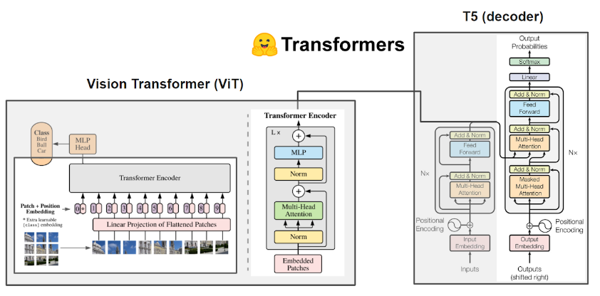

# Image Captioning

In this project, a combination of Transformers was used to perform the Image Captioning task. The details are described below:
- :gear: Architecture: encoder-decoder type
    - 	Encoder: ViT [Hugging Face link](https://huggingface.co/google/vit-base-patch16-224-in21k) (paper [An Image is Worth 16x16 Words](https://doi.org/10.48550/arXiv.2010.11929))
    - 	Decoder: T5 [Hugging Face link](https://huggingface.co/t5-base) (paper [Text-to-Text Transformer](https://arxiv.org/abs/1910.10683))

- :framed_picture: Datasets:
    -   MS COCO Captions (for fine-tuning and quantitative evaluation)
    -   Cityscapes  (for qualitative evaluation)

- :weight_lifting_woman: Training:
    -   40 epochs
    -   GPU: Tesla P100-PCIE-16GB
    -   Dataloader with num_workers of 3 and batch_size of 20
    -   Loss function: cross-entropy (Hugging Face)
    -   Optimizer: Adam with learning rate of 1e-5
- :chart_with_upwards_trend: Experiment tracking: Weights & Biases 
    -   [training tracking](https://wandb.ai/larissa_santesso/ImageCaptioning_Project/runs/21xojhph?workspace=user-larissa_santesso)
    -   [evaluation](https://wandb.ai/larissa_santesso/ImageCaptioning_Project/runs/32mzuqkb?workspace=user-larissa_santesso)

## Model

## :books: Tutorial

## References
