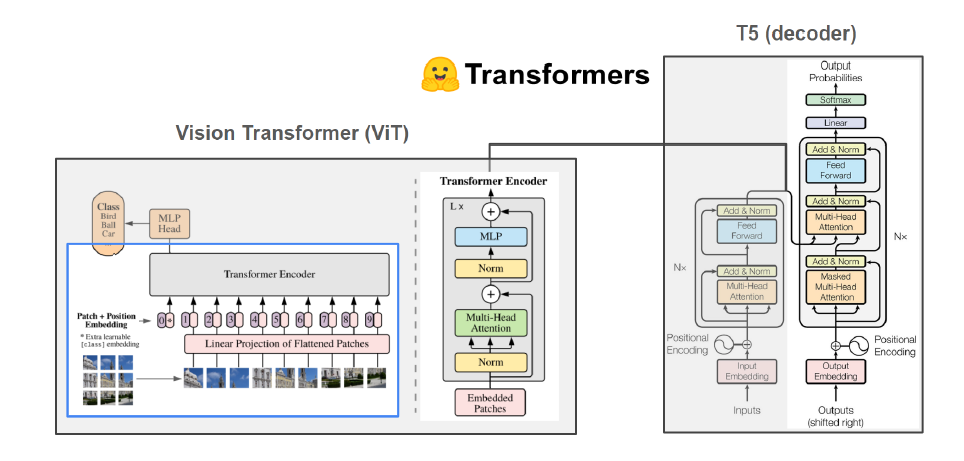

# Image Captioning

    
    
    

---
In this project, a combination of Transformers was used to perform the Image Captioning task. A qualitative evaluation on a never seen dataset was done in order to check if the model can generalize well. In  this case, it was evaluated in the area of vehicle navigation with the dataset Cityscapes. The details are described below:

- :gear: Architecture: encoder-decoder type
    - 	Encoder: ViT [Hugging Face link](https://huggingface.co/google/vit-base-patch16-224-in21k) ([@vit])
    - 	Decoder: T5 decoder [Hugging Face link](https://huggingface.co/t5-base) (paper [Text-to-Text Transfer Transformer]([@t5])

- :framed_picture: Datasets:
    -   MS COCO Captions (for fine-tuning and quantitative evaluation)
    -   Cityscapes  (for qualitative evaluation)

- :weight_lifting_woman: Training:
    -   40 epochs
    -   GPU: Tesla P100-PCIE-16GB
    -   Dataloader with num_workers of 3 and batch_size of 20
    -   Loss function: cross-entropy (Hugging Face)
    -   Optimizer: Adam with learning rate of 1e-5
- :chart_with_upwards_trend: Experiment tracking: Weights & Biases 
    -   [training tracking](https://wandb.ai/larissa_santesso/ImageCaptioning_Project/runs/21xojhph?workspace=user-larissa_santesso)
    -   [evaluation](https://wandb.ai/larissa_santesso/ImageCaptioning_Project/runs/32mzuqkb?workspace=user-larissa_santesso)

## Model

 Image composed with images from [Hugging Face](https://huggingface.co/) and from papers [@vit] and [@t5]

## :books: Tutorial

All codes are located in categorized notebooks, each one is called according to the necessity of the variables or functions to be imported.  Google Colab Pro was used in this project due to the large size of the models.

-   [run00_dataset.ipynb](https://github.com/larissasantesso/IA025A_FinalProject_ImageCaptioning/blob/main/notebooks/run00_dataset.ipynb): install and import libraries, import dataset, declare configuration variables and other functions. 
-   [run01_metrics.ipynb](https://github.com/larissasantesso/IA025A_FinalProject_ImageCaptioning/blob/main/notebooks/run01_metrics.ipynb): declare function to calculate metrics.
-   [run02_models.ipynb](https://github.com/larissasantesso/IA025A_FinalProject_ImageCaptioning/blob/main/notebooks/run02_models.ipynb): model is defined in this notebook. 
-   [run03_training_exp008.ipynb](https://github.com/larissasantesso/IA025A_FinalProject_ImageCaptioning/blob/main/notebooks/run03_training_exp008.ipynb): contains all trainings and evaluations looping over the epochs. 
-   [run04_evaluation_exp008.ipynb](https://github.com/larissasantesso/IA025A_FinalProject_ImageCaptioning/blob/main/notebooks/run04_evaluation_exp008.ipynb): all datasets splits (including the original validation) and also a subdataset with filtered categories are evaluated quantitatively with the COCOEvalCap tool. Filtered Categories was used with the intention of retrieving similar images with the Cityscapes dataset.
-   [run05_cityscapes.ipynb](https://github.com/larissasantesso/IA025A_FinalProject_ImageCaptioning/blob/main/notebooks/run05_cityscapes.ipynb): zero-shot of trained model in the Cityscapes dataset. 

:warning: Some functions were commented in the notebooks run00, run01 and run02 for the purpose of not raising errors and not waste memory since they are called in other notebooks. If you would like to test uncomment each one, but remember to comment when running run03, run04 and run05.

***
## References

output:
  md_document:
    variant: markdown_github
bibliography: bibliography.bib
